# Project – Active Directory & SOC Home Lab (MYDFIR Series)

---

## Overview

This project is a fully functional **Active Directory & SOC Home Lab** built from scratch inside Oracle VirtualBox, following the [MYDFIR YouTube series](https://www.youtube.com/@mydfir). It simulates a real-world enterprise environment where I configured a domain controller, deployed a Splunk SIEM, installed Sysmon for deep endpoint telemetry, and performed attack simulations using Kali Linux and Atomic Red Team — all mapped to the MITRE ATT&CK framework.

This lab mirrors the full SOC analyst cycle: **environment setup → endpoint instrumentation → attack simulation → log analysis and detection**.

---

## Network Diagram

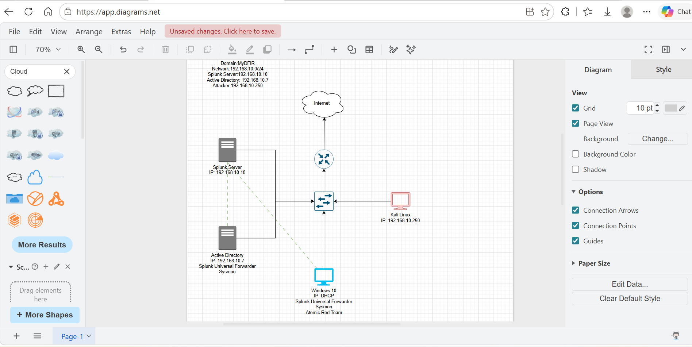
*Logical network diagram built in Draw.io — Domain: MyDFIR | Network: 192.168.10.0/24*

| Host | Role | IP Address |
|------|------|-----------|
| Splunk Server (Ubuntu) | SIEM / Log Aggregation | 192.168.10.10 |
| Active Directory (Windows Server 2022) | Domain Controller / Splunk UF / Sysmon | 192.168.10.7 |
| Windows 10 (target-PC) | Target Machine / Splunk UF / Sysmon / Atomic Red Team | DHCP → Static |
| Kali Linux | Attacker Machine | 192.168.10.250 |

---

## Environment

| Tool | Purpose |
|------|---------|
| Oracle VirtualBox | Hypervisor — all VMs run locally, no cloud |
| Windows Server 2022 | Active Directory Domain Services (AD DS) |
| Windows 10 Pro | Target endpoint for attack simulation |
| Ubuntu Server | Splunk SIEM host |
| Kali Linux 2026.1 | Offensive attack platform |
| Splunk Enterprise 10.2.3 | Log ingestion, search, and detection |
| Sysmon (Olaf Hartong config) | Deep endpoint telemetry |
| Atomic Red Team | MITRE ATT&CK-mapped attack simulation |
| Draw.io | Network diagram documentation |

---

## Lab Build – Step by Step

---

### Part 1 – VM Setup & Network Configuration

#### Splunk Server (Ubuntu)

Installed Ubuntu Server on a VirtualBox VM (8 GB RAM, 100 GB disk, 2 CPUs) to host the Splunk SIEM instance. Installation completed successfully and the machine was promoted to the Splunk server role.

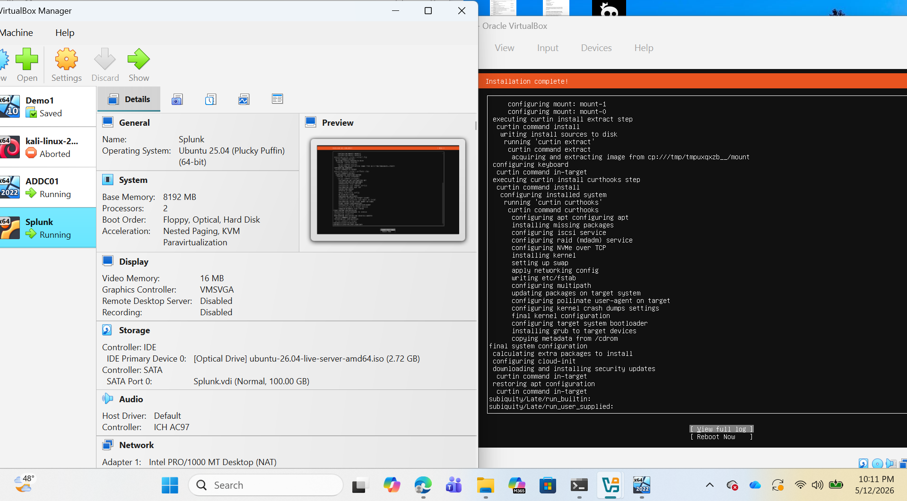
*Ubuntu Server installation complete — this VM serves as the Splunk SIEM server*

#### Kali Linux — Attacker Machine

Imported the Kali Linux 2026.1 VirtualBox image directly into Oracle VirtualBox Manager. Configured with 2 GB RAM and NAT network adapter.

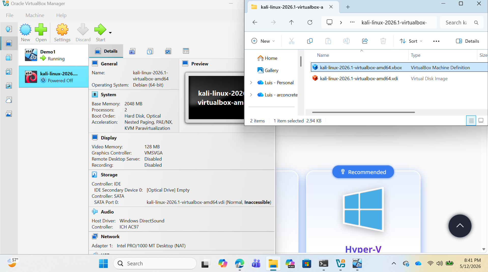
*Importing kali-linux-2026.1-virtualbox-amd64 into VirtualBox Manager*

---

### Part 2 – Windows Target Machine Configuration

#### Renaming the Machine to target-PC

Navigated to **Settings → System → About → Rename this PC** and renamed the Windows 10 machine from its default name to `target-PC` to align with the lab naming convention.

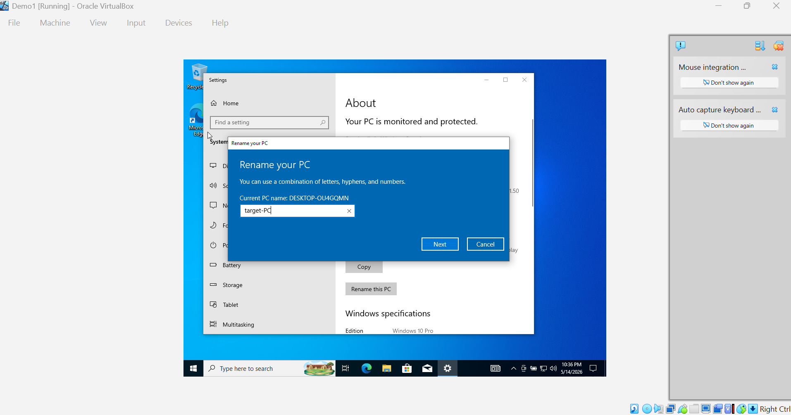
*Renaming the machine — current name DESKTOP-OU4GQMN being changed to target-PC*

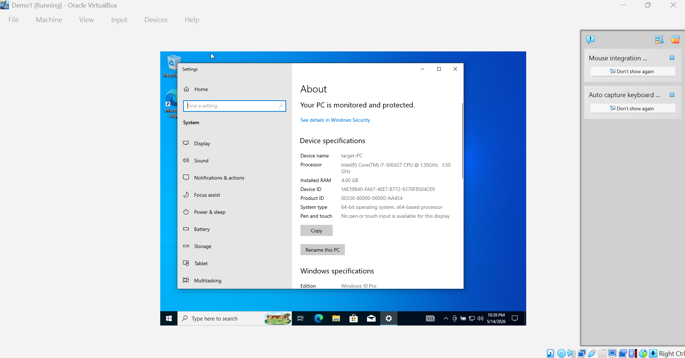
*Device name confirmed as target-PC in System Settings*

#### Setting a Static IP Address

Ran `ipconfig` to check the current DHCP-assigned IP (192.168.10.5), then navigated to **Network & Internet → Change adapter options → Ethernet → IPv4 Properties** to assign a static IP aligned with the network diagram.

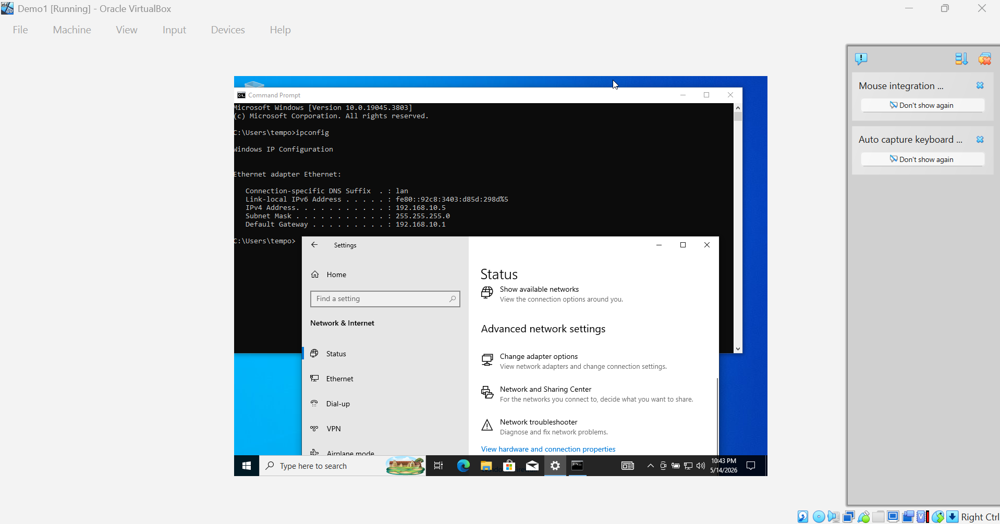
*ipconfig showing DHCP-assigned IP 192.168.10.5 — needs to be set statically*

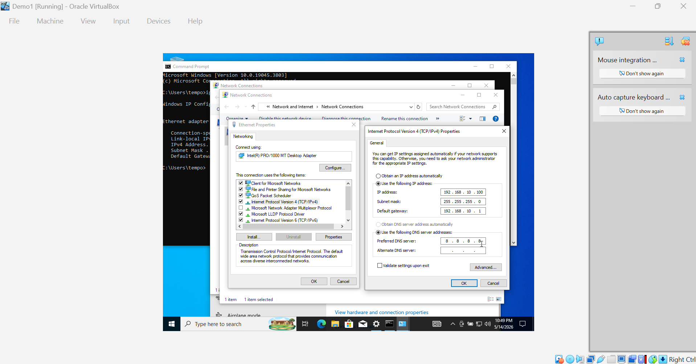
*Setting static IP 192.168.10.100, subnet 255.255.255.0, gateway 192.168.10.1, DNS 8.8.8.8*

---

### Part 3 – Active Directory & Domain Join

#### Navigating to Advanced System Settings

On the Windows target machine, searched for **PC Properties → Advanced System Settings** to access the domain join dialog.

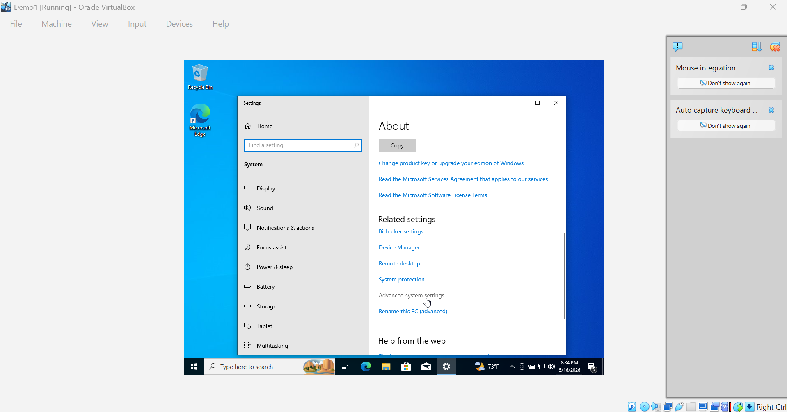
*Navigating to Advanced System Settings to configure domain membership*

#### Joining the MYDFIR.LOCAL Domain

Under **Computer Name/Domain Changes**, selected **Domain**, entered `MYDFIR.LOCAL`, and clicked OK. An initial error was encountered because the Active Directory DNS had not yet fully propagated — this was resolved by ensuring the preferred DNS on the target-PC pointed to the domain controller IP (192.168.10.7).

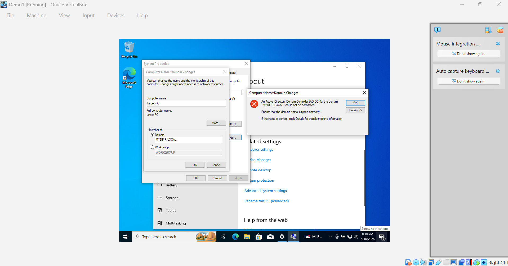
*Domain join attempt for MYDFIR.LOCAL — DC not contactable until DNS was corrected*

#### Active Directory Users and Computers

After the domain controller was fully configured, navigated to **Server Manager → Tools → Active Directory Users and Computers** to manage the domain, organizational units, and user accounts.

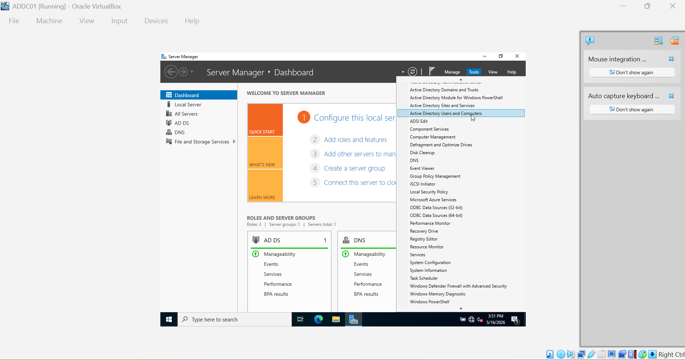
*Server Manager → Tools → Active Directory Users and Computers on ADDC01*

---

### Part 4 – Sysmon Deployment

#### Finding the Olaf Hartong Sysmon Configuration

Searched for the **olafhartong/sysmon-modular** configuration on GitHub — a community-maintained modular Sysmon config widely used in SOC labs for comprehensive endpoint telemetry.

*Searching for sysmon olaf config — GitHub result: olafhartong/sysmon-modular*

#### Installing Sysmon64 via PowerShell

Opened an Administrator PowerShell session, navigated to the Sysmon download directory, and executed `.\Sysmon64.exe` with the Olaf config to install Sysmon with full telemetry coverage on the target machine.

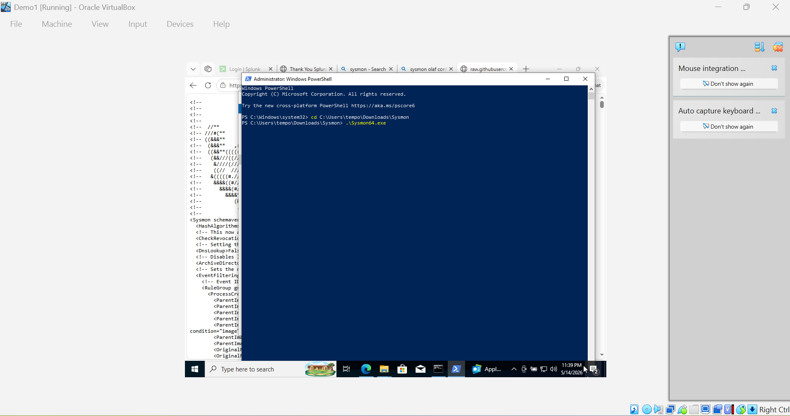
*Running .\Sysmon64.exe from the Sysmon download folder in an elevated PowerShell session*

---

### Part 5 – Attack Simulation & Splunk Detection

#### MITRE ATT&CK Techniques — Command and Scripting Interpreter

Reviewed MITRE ATT&CK technique **T1059 – Command and Scripting Interpreter** sub-techniques to select attack scenarios for simulation using Atomic Red Team on the target-PC.

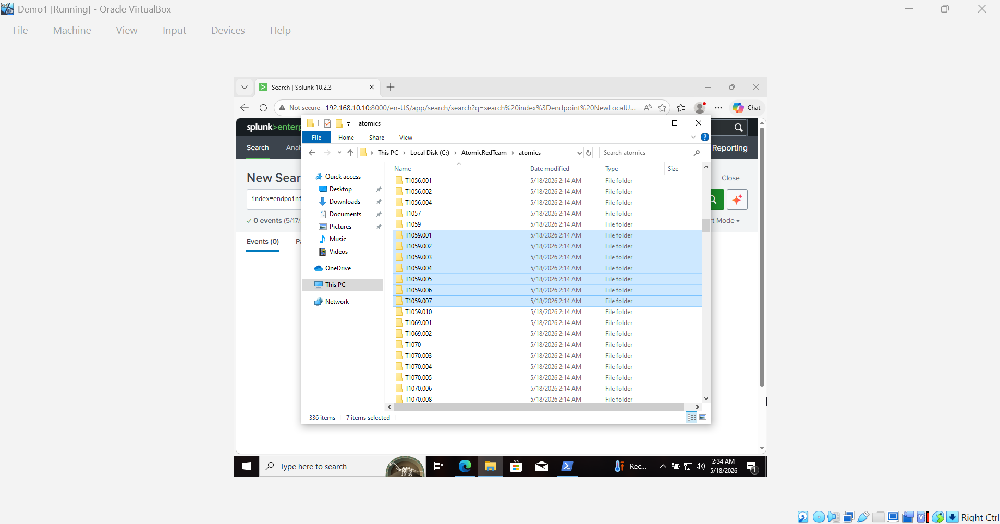
*MITRE ATT&CK T1059 sub-techniques — T1059.001 (PowerShell) selected for simulation via Atomic Red Team*

#### Atomic Red Team — T1059 Folder Structure

Atomic Red Team was installed on target-PC with Windows Defender exclusion set for `C:\` to prevent removal of test artifacts. The AtomicRedTeam atomics folder contains MITRE-mapped technique folders including T1059.001–T1059.007, T1069, T1070, and more.

*AtomicRedTeam atomics folder on target-PC — 336 items covering MITRE ATT&CK techniques*

#### Splunk Detection — PowerShell Telemetry

After running `Invoke-AtomicTest T1059.001` on the target machine, searched Splunk with `index=endpoint powershell` to confirm telemetry was captured. **30 events** were returned, with the first event showing `technique_id=T1059.001` and `technique_name=PowerShell` — confirming end-to-end detection.

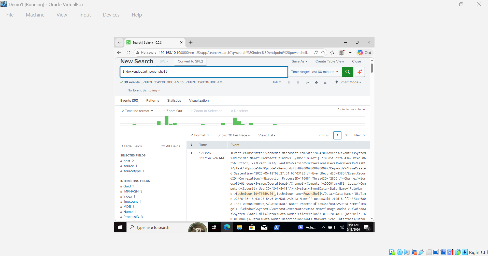
*Splunk search `index=endpoint powershell` returning 30 events — technique_id=T1059.001 confirmed in event data*

---

## Skills Demonstrated

| Skill | How It Was Applied |
|-------|--------------------|
| Virtual Lab Design | Designed and built a multi-VM environment from scratch using VirtualBox and Draw.io for documentation |
| Active Directory Administration | Promoted Windows Server to DC, configured AD DS, created OUs and user accounts |
| Network Configuration | Assigned static IPs, configured NAT networking, troubleshot DNS for domain join |
| SIEM Deployment | Installed and configured Splunk Enterprise on Ubuntu; set up indexes and forwarders |
| Endpoint Instrumentation | Deployed Sysmon with Olaf Hartong's modular config on both Windows machines |
| Splunk Universal Forwarder | Configured log forwarding from AD and target-PC to Splunk |
| Attack Simulation | Used Kali Linux for brute-force simulation and Atomic Red Team for MITRE ATT&CK-mapped techniques |
| Log Analysis | Queried Splunk to detect PowerShell execution, local account creation, and authentication events |
| MITRE ATT&CK Mapping | Mapped simulated attacks to T1059.001, T1136.001, and related techniques |
| Documentation | Captured evidence at every step with consistent screenshots and structured write-up |

---

## Key Detections

| Technique | MITRE ID | Detection Method |
|-----------|---------|-----------------|
| PowerShell Execution | T1059.001 | `index=endpoint powershell` in Splunk — 30 events returned |
| New Local User Creation | T1136.001 | `index=endpoint NewLocalUser` — telemetry of persistence technique |
| Brute Force / Failed Logins | T1110 | EventCode=4625 in Splunk — 20 failed attempts from Kali (192.168.10.250) |
| Successful Login Post-Attack | — | EventCode=4624 — confirmed successful auth from Kali machine |

---

## Lessons Learned

**Sysmon configuration matters enormously.** The difference between a generic Sysmon install and the Olaf Hartong modular config is the depth of telemetry — particularly for process creation, DLL loads, and network connections. Without proper Sysmon tuning, many ATT&CK techniques would generate no actionable events in Splunk.

**DNS is everything for Active Directory.** The initial domain join failure was caused by the target-PC using an external DNS server (8.8.8.8) instead of pointing to the domain controller. In production environments, misconfigured DNS is one of the most common causes of AD connectivity failures.

**Visibility before detection.** This lab reinforced that you cannot detect what you cannot see. Deploying Splunk Universal Forwarder + Sysmon on every endpoint is the baseline requirement before any detection logic can be effective.

**Atomic Red Team bridges theory and practice.** Running `Invoke-AtomicTest T1059.001` and then immediately finding it in Splunk makes the MITRE ATT&CK framework tangible rather than abstract — a core skill for any SOC analyst building detection rules.

---

## References & Credits

- [MYDFIR YouTube Series](https://www.youtube.com/@mydfir) — Full lab walkthrough by Steven
- [Olaf Hartong — sysmon-modular](https://github.com/olafhartong/sysmon-modular) — Sysmon configuration
- [Atomic Red Team](https://github.com/redcanaryco/atomic-red-team) — Red Canary's ATT&CK-mapped test library
- [MITRE ATT&CK Framework](https://attack.mitre.org/) — Adversary technique reference
- [Splunk Documentation](https://docs.splunk.com/Documentation/Splunk) — SIEM platform
